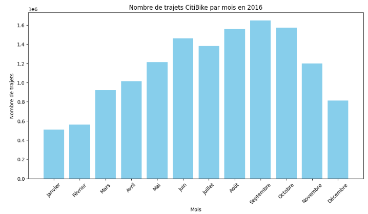
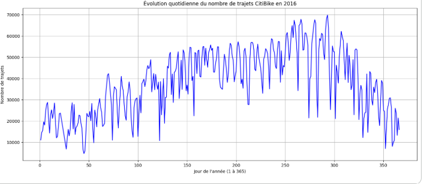

<div align="center">

# 🚲 Citi Bike NYC (2016)  
### Analyse Big Data avec Apache Spark & PySpark  

Analyse à grande échelle des trajets du système de vélos en libre-service de New York, en utilisant le traitement distribué.

</div>

---

## 📌 Présentation

Ce dépôt contient un **projet complet d’analyse Big Data** basé sur les données de trajets **Citi Bike NYC (2016)**.  
L’analyse est réalisée dans un **Notebook Jupyter** en utilisant **Apache Spark et PySpark**, illustrant un workflow complet d’analytique sur un dataset réel.

Ce projet est publié comme un **projet portfolio personnel**.

---

## 🎯 Objectifs du Projet

- Traiter de grands fichiers CSV avec **Apache Spark**
- Effectuer le nettoyage et le prétraitement des données à grande échelle
- Exécuter des requêtes analytiques avec **Spark SQL** et l’API **DataFrame**
- Étudier les tendances temporelles et la popularité des stations
- Visualiser les principaux résultats issus des données de trajets

---

## 🧰 Technologies Utilisées

| Catégorie        | Outils |
|------------------|--------|
| Big Data         | Apache Spark |
| Traitement       | PySpark (SQL & DataFrame API) |
| Langage          | Python 3 |
| Environnement    | Jupyter Notebook |
| Visualisation    | Matplotlib, Pandas |

---

## 📊 Jeu de Données

Le dataset est fourni par **Citi Bike New York City Open Data** et contient des trajets anonymisés.

🔗 **Portail officiel**  
https://citibikenyc.com/system-data  

🔗 **Téléchargement direct (données 2016)**  
https://s3.amazonaws.com/tripdata/2016-citibike-tripdata.zip  

### Caractéristiques du dataset

- Fichiers CSV mensuels (Janvier–Décembre 2016)
- Plusieurs millions d’enregistrements
- Horaires et stations de départ/arrivée
- Durée des trajets et type d’utilisateur
- Informations démographiques optionnelles

> ⚠️ En raison de sa taille, le dataset **n’est pas inclus** dans ce dépôt.

---

## 📁 Structure Attendue des Données

Après téléchargement et extraction :

```bash
2016-citibike-tripdata/
└── data/
    └── 2016/
        ├── 201601-citibike-tripdata.csv
        ├── 201602-citibike-tripdata.csv
        ├── ...
        └── 201612-citibike-tripdata.csv


---

## 📊 Data Visualizations

Below are some key visualizations generated directly from the Spark-based analysis notebook.

### 🚲 Monthly Number of Trips (2016)

This bar chart shows the total number of Citi Bike trips per month in 2016.  
It clearly highlights the **strong seasonality** of bike usage, with a peak during summer months.

<p align="center">
  
</p>

---

### 📈 Daily Evolution of Trips (Day 1–365)

This time-series plot represents the **daily number of trips throughout the year**.  
It reveals:
- gradual growth from winter to summer
- high variability during peak season
- a decline toward the end of the year

<p align="center">
  
</p>

---

> 📌 All visualizations are produced using data processed with **Apache Spark** and plotted in the Jupyter Notebook.


